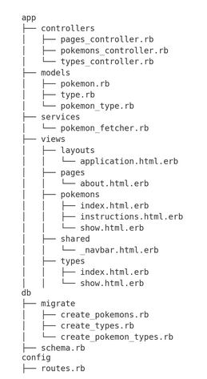

Project Overview

Pokémon Hub is a web application built with Ruby on Rails, utilizing GraphQL to fetch Pokémon data from the GraphQL Pokémon API ( "https://graphqlpokemon.favware.tech/v8"). The application displays a list of Pokémon, their types, and various attributes. Users can filter Pokémon by type, search for specific Pokémon, and sort the list in different ways.

Database ERD

File Structure

The file structure of this project is organized as follows:

Running the Project

To run the project locally:

    Clone the repository.
    Run bundle install to install dependencies.
    Set up the database with rails db:setup.
    Fetch Pokémon data using the pokemon_fetcher service.
    Start the Rails server with rails server.
    Open your browser and navigate to http://localhost:3000.

Contributing

If you'd like to contribute to this project, please fork the repository and use a feature branch. Pull requests are welcome.

